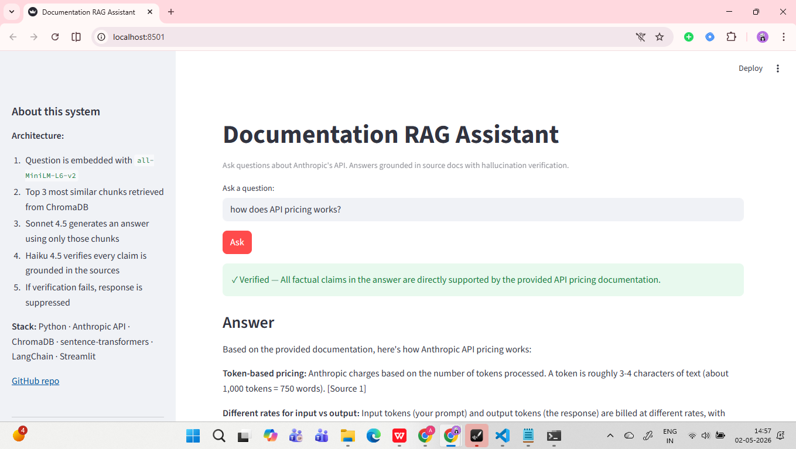

# Documentation RAG Assistant

A production-pattern Retrieval-Augmented Generation system that answers questions from a documentation corpus, with explicit hallucination verification before responding.

Built to demonstrate "last-mile" engineering for AI: not just a working demo, but the eval harness, grounding checks, and production tradeoffs that separate a prototype from a system you'd put in front of users.

## Demo

**🔗 Live demo: https://asra-doc-rag-assistant.streamlit.app**



First load takes ~60 seconds (one-time index build on cold start). Run locally with `streamlit run app.py` for instant queries.
## Architecture

~~~
User question
    │
    ▼
[1] Embed (sentence-transformers / all-MiniLM-L6-v2, 384 dim)
    │
    ▼
[2] Retrieve top-3 chunks from ChromaDB (cosine similarity)
    │
    ▼
[3] Generate answer (Claude Sonnet 4.5)
    │   System prompt: "Use only the provided context. If not answerable, say so."
    │
    ▼
[4] Verify (Claude Haiku 4.5)
    │   For every factual claim, is it supported by the chunks?
    │   Returns structured JSON with per-claim reasoning.
    │
    ▼
[5a] PASS → return answer + citations
[5b] FAIL → suppress answer, return safe-fallback message
~~~

Two-pass design (answerer + verifier) trades latency for trust. The verifier uses a smaller, cheaper model because the task is judgment, not generation.

## Stack

- **Language:** Python 3.13
- **LLM:** Anthropic Claude Sonnet 4.5 (answerer), Claude Haiku 4.5 (verifier)
- **Embeddings:** `sentence-transformers/all-MiniLM-L6-v2` (runs locally, no API)
- **Vector store:** ChromaDB (persistent, local)
- **Chunking:** LangChain `RecursiveCharacterTextSplitter` (500 char chunks, 50 char overlap)
- **UI:** Streamlit
- **Evals:** custom JSON test cases + scoring script

## Setup


> Or just visit the [live demo](https://asra-doc-rag-assistant.streamlit.app) — no install needed.
```bash
git clone https://github.com/AsraMohammad/rag-support-agent.git
cd rag-support-agent

python -m venv venv
venv\Scripts\activate         # Windows
# source venv/bin/activate    # Mac/Linux

pip install -r requirements.txt

# Add your Anthropic API key
echo ANTHROPIC_API_KEY=sk-ant-... > .env

# Build the index (one time)
python chunk_documents.py
python build_index.py

# Run the UI
streamlit run app.py
```

## Evaluation

10-question eval suite covering 7 in-domain and 3 out-of-domain questions.

| Metric | Value |
|---|---|
| Verdict accuracy | **100% (10/10)** |
| Avg latency per query | 5.6s |
| Total tokens used | ~15,000 |
| Estimated cost (full suite) | $0.05 |
| Cost per query | ~$0.005 |

Run with `python run_evals.py`. Full per-test results saved to `evals/eval_results.json`.

## Design tradeoffs (the honest part)

**Two LLM calls per query roughly doubles latency** — ~5.6s avg vs ~2-3s for single-pass systems. For a customer-facing chat product this is too slow without streaming. Mitigations: (a) stream the answerer's tokens to the user while running the verifier in parallel, retract if it fails; (b) skip verification for queries with very high retrieval similarity.

**LLM-as-judge has shared blind spots.** The verifier and answerer come from the same model family, so they may agree on the same wrong answer. A more robust setup uses a different family (e.g. GPT or Gemini) as the verifier, or requires consensus across multiple verifiers. Not implemented here for cost reasons.

**Verifier output budgets matter.** Initial implementation used `max_tokens=1024` for the verifier, which truncated mid-JSON on longer answers — causing valid responses to be wrongly suppressed. Fixed by raising the budget to 2048, constraining the prompt to brief reasoning, and adding partial-extraction fallback that recovers the verdict if the JSON breaks mid-output. Caught in real usage, not in the eval set — a reminder that 10-question eval suites don't cover edge cases.

**Eval set is small (10 questions).** Sufficient to demonstrate the pipeline works, not sufficient to claim production reliability. A real deployment would have 100-500 labelled cases and CI that runs evals on every change.

**Embedding model produces wide score ranges.** The `all-MiniLM-L6-v2` model returns negative cosine similarities even for relevant matches. Absolute thresholds (e.g. "reject below 0.3") are unreliable. We rely on relative ranking + the verifier instead.

**ChromaDB is single-machine.** Fine for portfolio scale. A real production system would use Postgres+pgvector or a managed service like Pinecone for horizontal scaling and durability.

**No semantic cache.** A repeat question incurs full retrieval + generation cost. Adding Redis with embedding-keyed caching would cut cost by ~30-50% on real traffic.

## Project structure

~~~
rag-support-agent/
├── docs/                    # source documentation (markdown)
├── evals/
│   ├── test_cases.json      # eval suite
│   └── eval_results.json    # last run output
├── chroma_db/               # vector index (gitignored, regenerated)
├── chunk_documents.py       # load + chunk
├── build_index.py           # embed + store
├── search.py                # search-only CLI
├── rag.py                   # full pipeline + verifier wiring
├── verifier.py              # grounding verifier module
├── run_evals.py             # eval harness
├── app.py                   # Streamlit UI
└── README.md
~~~

## Built in public

This project was built across a single ~8-hour focused session as a deliberate pivot into AI engineering. Commits document the journey phase by phase.

**Dependency conflicts at deploy time.** First production deploy failed with `TypeError: Descriptors cannot be created directly` from a protobuf version mismatch — `langchain==1.2.x` pulls in `langgraph` which requires protobuf ≥5, but `chromadb` requires ≤4. Fixed by removing the unused `langchain` meta-package (only `langchain-text-splitters` is actually needed) and pinning `protobuf<5`. Caught at deploy, not in local dev — a lesson in how local-only `pip freeze` can hide transitive conflicts that only surface in clean environments.

## License

MIT